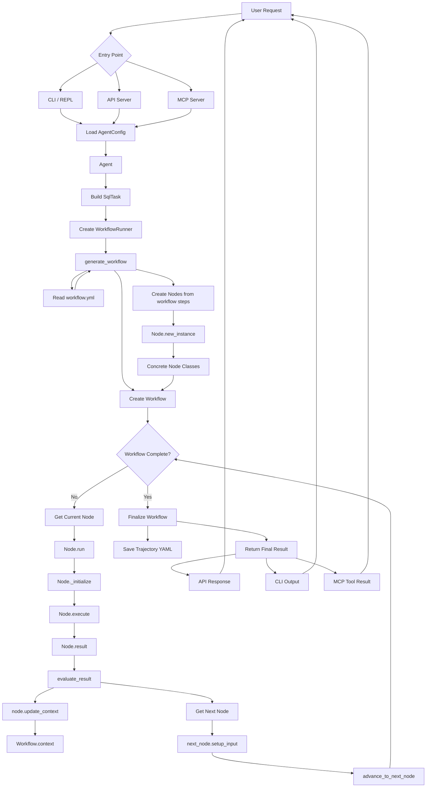

Recently, I have been studying an open source Data AI Agent project: Datus Agent. The core problem it tries to solve is the gap between "natural language" and "accurate SQL" in enterprise data engineering. More specifically, it targets several key pain points in enterprise data engineering:
> 1. LLMs hallucinate when generating SQL directly. Large models do not understand the table structures, field meanings, or business logic of internal business systems. The SQL they generate may invent column names or produce incorrect JOIN relationships. Datus builds an evolvable context knowledge base, including schema metadata, reference SQL, semantic models, and metric definitions, to provide business context for every AI query and reduce hallucination.
> 2. Ad hoc data requests consume a large amount of data engineers' time. Business users often ask engineers to "run a number" in chat groups. Data engineers spend too much time handling repetitive ad hoc SQL, while the business knowledge behind those queries is rarely captured or reused systematically. Datus automates this kind of work: business users ask questions in natural language, AI generates accurate SQL and returns results, and data engineers can shift their effort from "writing SQL" to "building better data context."
> 3. SQL knowledge becomes isolated in individuals' heads. Only one person may know how to use a table or what a complex query really means. When that person leaves, the knowledge is lost. Datus automatically captures, classifies, and vectorizes historical SQL, supports semantic search with natural language, and turns individual experience into a shared "collective SQL intelligence asset" for the team.
> 4. Metric definitions are inconsistent, and different departments write their own SQL. Should "monthly active users" be calculated by registration time or login time? Marketing, product, and finance teams may all write different SQL. Datus integrates executable metric definitions through MetricFlow. With "metrics as code," the whole company can query from the same semantic layer and unify definitions at the source.
> 5. Traditional data engineering is hard to evolve, and assets are difficult to accumulate. Data models, SQL templates, and business rules are often discarded after one task and rewritten next time. The Datus context layer has long-term memory: every query, correction, and feedback action can be persisted as knowledge. The more it is used, the more accurate the AI becomes, and the thicker the knowledge base grows.
> 6. The path from exploration to delivery is broken. Data engineers explore in the command line, then manually package the result into dashboards, chatbots, or APIs for business users. Datus provides an end-to-end path: CLI exploration -> context accumulation -> packaging as a Subagent -> delivery through Web Chat / REST API / MCP.

Architecturally, Datus uses a four-layer design:

- User interface layer: provides four entry points, including CLI (interactive command-line REPL), Web Chatbot (chat interface for business analysts), REST API (for other applications or agents), and MCP Server (for external tools such as Claude Desktop and Cursor), covering different scenarios for data engineers and analysts.
- Command processing layer: handles slash commands such as /model for model switching, /datasource for data source configuration, and /gen_semantic_model for semantic model generation. It also handles REPL interaction parsing and Plan Mode, a human-review mode that plans before execution and enables Human-in-the-Loop control.
- Core engine layer: based on a configurable node-based workflow engine. A workflow consists of a series of nodes and supports sequential execution, parallel execution, and sub-workflows. Core nodes include schema_linking for table schema matching, gen_sql for SQL generation, reasoning for reflection and reasoning, execute_sql for query execution, and selection for choosing among multiple results. Each node can independently dispatch a different LLM model.
- Data and storage layer: uses a dual-track storage architecture with LanceDB (vector database) and RDB (relational database). The vector database supports semantic retrieval, such as Schema Linking and document search. The relational database stores structured metadata, such as sessions, feedback, and successful cases. This layer also organizes a multi-level RAG knowledge base, including table schema metadata, reference SQL, Jinja2 parameterized SQL templates, semantic models, and business metric definitions. Together, these components form a continuously evolving "data context graph."

From natural language input to query result output, the whole Datus-Agent system follows a clear one-way pipeline. It can be roughly divided into six stages:

1. Entry routing
  The user request first reaches the entry routing layer. Datus provides three access methods:

  - CLI / REPL: command-line interactive mode for data engineers' daily exploration and context building;
  - API Server (FastAPI): RESTful interface for third-party applications or agents to call programmatically;
  - MCP Server: follows the Model Context Protocol and can be consumed directly by external agent clients such as Claude Desktop and Cursor.
  These three entry points eventually converge into the configuration loading stage.
2. Configuration loading
No matter which entry point the request comes from, it first loads AgentConfig, which is merged from the global agent.yml and the project-level .datus/config.yml. AgentConfig contains global settings such as the target LLM model, data source connections, workflow definitions, and knowledge base paths, providing all runtime parameters for subsequent execution.
3. Task construction and workflow generation
  After configuration is ready, the Agent wraps the user request into a SqlTask object and hands it to WorkflowRunner. The generate_workflow stage completes three things:

  - Reads the workflow definition for the current scenario from workflow.yml, such as a fixed flow or a reflection self-healing flow;
  - Instantiates the Workflow object and determines the execution plan, including sequential execution, parallel execution, or sub-workflow invocation;
  - Iterates through workflow steps and maps each step to a concrete node class instance through the Node.new_instance factory method, such as schema_linking, gen_sql, reasoning, and execute_sql, assembling them into an executable directed node graph.
4. Node-by-node execution (core loop)
The workflow enters the main loop: an iterative process of "fetch node -> execute -> evaluate -> advance":
1. Fetch current node: get the next node to execute according to the orchestration rules;
6. Three-step execution:

   - _initialize: loads the context required by the node, such as schema fragments, reference SQL, and semantic models, and builds the LLM prompt;
   - execute: calls the LLM model bound to the node to execute the core logic, such as SQL generation, reasoning, or query execution;
   - result: collects and standardizes node output for downstream nodes;
3. Evaluation and context update: evaluate_result performs quality evaluation on the node output, such as syntax validation and result reasonableness checks. After passing, update_context writes the result into the shared Workflow.context;
4. Advance to next node: get_next_node determines the next step, setup_input injects upstream output and current context into the next node, and advance_to_next_node advances the workflow pointer back to the start of the loop.
Some workflows, such as reflection mode, support dynamically injecting repair nodes when a node fails, enabling self-healing retries.
5. Finalization and persistence
After all nodes are executed, the workflow enters the Finalize stage:
- Serializes the complete execution trace, including input, output, latency, and model choice for each step, into Trajectory YAML and persists it under {agent.home}/trajectory/ for postmortem review, debugging, and observability;
- Assembles the final result, including generated SQL, execution result, and natural language explanation, into a standard response body.
6. Response return
The final result is returned through the original entry path: CLI outputs to the terminal, API returns a JSON response, and MCP returns a Tool Result, completing the request loop.

In one sentence: Datus is a configuration-driven, node-based workflow orchestration engine for NL2SQL. A user question enters the system and goes through task construction -> workflow generation -> node-by-node execution with evaluation feedback -> trajectory persistence -> result return, with the whole context traceable and reviewable.
