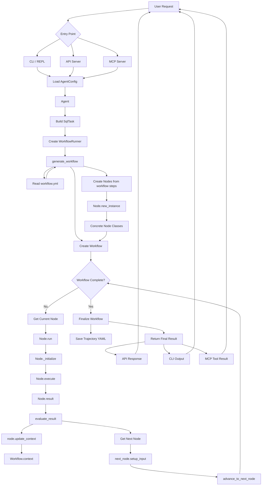

最近在学习一个开源 Data AI Agent 项目 —— Datus Agent。它要解决的核心问题是：企业数据工程中「自然语言 → 准确 SQL」的鸿沟。具体来说，它瞄准了企业数据工程的几个关键痛点：
> 1. LLM 直接生成 SQL 会「幻觉」 —— 大模型不了解业务系统的表结构、字段含义和业务逻辑，生成的 SQL 经常编造列名、拼错 JOIN 关系。Datus 构建了一个可演化的上下文知识库（schema 元数据、参考 SQL、语义模型、指标定义），为每次 AI 查询提供业务上下文基础，消除幻觉。
> 2. 临时取数请求占据数据工程师大量时间 —— 业务方每天在群里问「帮我跑个数」，数据工程师疲于应付重复的即席 SQL，花费一半的工作时间，而查询背后的业务知识很少被系统化捕获或复用。Datus 把这类工作自动化：业务人员通过自然语言提问，AI 生成准确 SQL 并返回结果，数据工程师的精力从「写 SQL」转向「建设更完善的数据上下文」。
> 3. SQL 知识孤岛 —— 经验锁在个人脑子里 —— 团队内只有某个人知道某张表怎么用、某段复杂查询的逻辑是什么，人一走知识就丢失。Datus 自动捕获、分类、向量化所有历史 SQL，支持用自然语言做语义搜索，将个人经验沉淀为团队共享的「集体 SQL 智能资产」。
> 4. 指标口径不一致，不同部门各写一套 —— 「月活用户」到底按注册时间算还是登录时间算？市场部、产品部、财务部的 SQL 各不一样。Datus 提供 MetricFlow 集成的可执行指标定义，「指标即代码」，全公司基于同一套语义查询，从根本上统一口径。
> 5. 传统数据工程不可演化，资产难以积累 —— 数据模型、SQL 模板、业务规则每次做完就扔，下次又要重写。Datus 的上下文层具备长期记忆能力：每次查询、纠错和反馈操作都会持久化为知识，AI 越用越准，知识库越滚越厚。
> 6. 从探索到交付的链路断裂 —— 数据工程师在命令行里探索，然后需要手动包装成看板、聊天机器人或 API 才能交付给业务方。Datus 提供端到端链路：CLI 探索 → 积累上下文 → 封装为 Subagent → 以 Web Chat / REST API / MCP 交付给分析师。

架构上，Datus 采用四层设计：

- 用户接口层：提供 CLI（命令行交互式 REPL）、Web Chatbot（面向业务分析师的聊天界面）、REST API（供其他应用/Agent 调用）、MCP Server（对接 Claude Desktop、Cursor 等外部工具）四种入口，覆盖数据工程师和分析师的不同使用场景。
- 命令处理层：负责处理斜杠命令（如 /model 切换模型、/datasource 配置数据源、/gen_semantic_model 生成语义模型等）、REPL 交互解析以及 Plan Mode（先规划后执行的人工审核模式），实现人在回路（Human-in-the-Loop）控制。
- 核心引擎层：基于可配置的节点工作流引擎（Node-based Workflow Engine）。工作流由一系列节点组成，支持顺序、并行、子工作流三种编排方式。核心节点包括 schema_linking（表结构匹配）、gen_sql（SQL 生成）、reasoning（推理反思）、execute_sql（查询执行）、selection（多结果择优）等，每个节点可独立分派不同的 LLM 模型。
- 数据与存储层：采用 LanceDB（向量数据库）+ RDB（关系数据库）双轨存储架构。向量库支撑语义检索（Schema Linking、文档搜索等），关系库存储会话、反馈、成功案例等结构化元数据。同时负责组织多层次的 RAG 知识库：表结构元数据、参考 SQL 库、Jinja2 参数化 SQL 模板、语义模型、业务指标定义等，所有组件构成一个持续演化的「数据上下文图谱」。

Datus-Agent 整个系统从用户输入自然语言到返回查询结果，遵循一条清晰的单向流水线，大体分为六个阶段：

1. 入口分发
  用户请求首先到达入口路由层。Datus 提供三种接入方式：

  - CLI / REPL：命令行交互模式，面向数据工程师的日常探索与上下文构建；
  - API Server（FastAPI）：RESTful 接口，供第三方应用或 Agent 程序化调用；
  - MCP Server：遵循 Model Context Protocol，可被 Claude Desktop、Cursor 等外部智能体客户端直接消费。
  三种入口殊途同归，最终统一进入配置加载环节。
2. 配置加载
无论从哪个入口进来，请求都会首先加载 AgentConfig——由全局 agent.yml 与项目级 .datus/config.yml 合并而成，包含目标 LLM 模型、数据源连接、工作流定义、知识库路径等全局设定，为后续执行提供全部运行时参数。
3. 任务构建与工作流生成
  配置就绪后，Agent 将用户请求封装为 SqlTask 对象，交由 WorkflowRunner 驱动执行。generate_workflow 阶段完成三件事：

  - 从 workflow.yml 读取当前场景对应的工作流定义（如 fixed 固定流程、reflection 反思自愈流程等）；
  - 实例化 Workflow 对象，确定执行计划（顺序执行 / 并行执行 / 子工作流调用）；
  - 遍历工作流步骤，通过 Node.new_instance 工厂方法将每步映射为具体的节点类实例（schema_linking、gen_sql、reasoning、execute_sql 等），组装成可执行的有向节点图。
4. 逐节点执行（核心循环）
工作流进入主循环——一个「取节点 → 执行 → 评估 → 推进」的迭代过程：
1. 取当前节点：根据编排规则获取下一个待执行的节点；
6. 执行三步曲：

   - _initialize：加载节点所需上下文（schema 片段、参考 SQL、语义模型等），构建 LLM 提示词；
   - execute：调用节点绑定的 LLM 模型执行核心逻辑（生成 SQL、推理分析、执行查询等）；
   - result：收集并标准化节点输出，供下游节点消费；
3. 评估与上下文更新：evaluate_result 对节点输出做质量评估（语法校验、结果合理性检查等）；通过后以 update_context 将结果写入共享的 Workflow.context；
4. 推进下一节点：get_next_node 确定下一步，setup_input 为下一节点注入上游输出与当前上下文，advance_to_next_node 推进工作流指针，回到循环起点。
部分工作流（如 reflection 模式）支持在节点失败时动态注入修复节点，实现自愈式重试。
5. 收尾与持久化
所有节点执行完毕后进入 Finalize 阶段：
- 将完整执行轨迹（每步输入、输出、耗时、模型选择）序列化为 Trajectory YAML，持久化到 {agent.home}/trajectory/，用于事后复盘、调试与可观测性；
- 将最终结果（生成的 SQL + 执行结果 + 自然语言解释）组装为标准响应体。
6. 响应回传
最终结果按原入口路径返回：CLI 输出至终端、API 返回 JSON 响应、MCP 返回 Tool Result，形成请求闭环。

一句话总结：配置驱动的、节点化工作流编排的 NL2SQL 执行引擎——「用户一句话进入，经任务构建 → 工作流生成 → 逐节点执行（带评估反馈）→ 轨迹持久化 → 结果回传」，全程上下文可追踪、可复盘。
