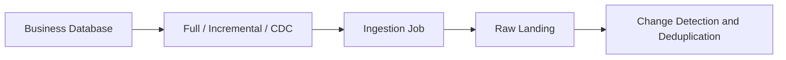
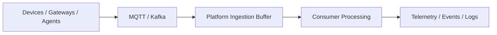
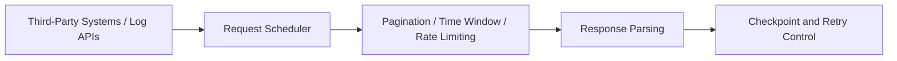
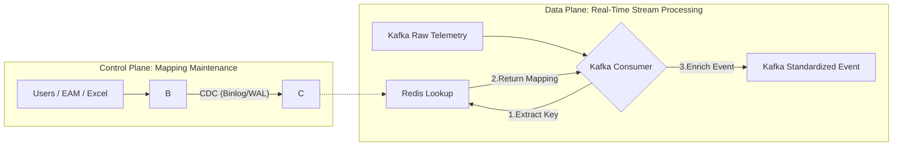
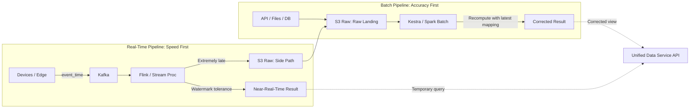

# 3. Building a Unified Ingestion Layer: Multi-Source Ingestion and Asset/Tag Mapping

## 1. From Ingestion to Alignment

In an industrial data platform, ingestion is only the beginning. You can connect databases, streaming systems, files, and APIs to the platform and still fall well short of real integration. The harder question is whether data from different systems, moving at different speeds and arriving in different shapes, can actually be aligned around the same business objects.

That challenge is especially sharp in EAM SaaS environments:

- **Identifier fragmentation**: the same asset may have completely different identifiers across EAM, MES, SCADA, and Historian systems;
- **Semantic ambiguity**: the same tag may differ in name, unit, or even meaning across systems;
- **Mixed source patterns**: master data may come from databases, real-time telemetry from streaming systems, historical backfill data from files, and operational logs from APIs.

Once a platform stops at “getting data in” and never reaches “getting data aligned,” the downstream cost shows up everywhere: unstable models, inconsistent reports, brittle analytics, and AI features built on shaky ground. That is why this article focuses on three practical questions:

1. Why different source types cannot share a single ingestion pattern;
2. Why Asset/Tag mapping is a non-negotiable part of industrial data integration;
3. How to keep the pipeline maintainable as batch and streaming coexist over time.

The goal of industrial integration is not to prove that data landed somewhere. It is to make sure that, once data enters the platform, it can be interpreted and reused through a shared business context.

------

## 2. Multi-Source Ingestion: A Source-Aware Strategy

One of the most common early mistakes is trying to force every source into the same ingestion pattern. Databases, streams, files, and APIs behave differently enough that they need different operational strategies:

- **Databases**: focus on incremental boundaries and delete awareness;
- **Message streams**: focus on ordering, idempotency, and replay;
- **Files**: focus on auditability, versioning, and backfill control;
- **APIs**: focus on pagination, rate limits, and historical coverage.

You can hide those differences for a while, but you cannot remove them. If the platform pretends every source is the same, operational complexity eventually catches up.

### 2.1 At a Glance: What Matters for Each Source

| Data Source         | Common Scenarios                                | Main Challenges                                              | Integration Focus                                          |
| ------------------- | ----------------------------------------------- | ------------------------------------------------------------ | ---------------------------------------------------------- |
| **Databases**       | Master data, work orders, business states       | Increment detection, deletion awareness, duplicate writes    | Incremental boundaries, CDC, rerun control                 |
| **Message Streams** | Telemetry, status, alarms, logs                 | Out-of-order events, duplicates, latency, replay             | Buffering and decoupling, event-time handling              |
| **Files**           | Historical imports, customer backfills, reports | Repeated uploads, version confusion, schema drift            | Audit trail, deduplication, backfill management            |
| **APIs**            | Third-party interfaces, logs, agent traces      | Complex pagination, rate limits, field changes, missing history | Checkpoint recovery, compatibility adaptation, retry logic |

### 2.2 Database Ingestion

Databases usually carry asset master data, work orders, and business state. The hard part is not connectivity. The hard part is **detecting change correctly**.

In an ideal setup, CDC (Change Data Capture) gives you insert, update, and delete events directly. In practice, teams often fall back to full extracts or timestamp-based incrementals. That immediately raises a few design questions:

- **Incremental criteria**: which timestamp or sequence field can actually be trusted;
- **Field trustworthiness**: whether `updated_at` really reflects business changes;
- **Delete awareness**: how to detect physical or logical deletes;
- **Idempotent reruns**: how to avoid duplicate data after failed retries.

At its core, database ingestion is about drawing the boundary of change correctly, not just copying rows from one place to another.



### 2.3 Streaming and Industrial Time-Series Ingestion

This category typically includes device telemetry, state events, and operational logs. What makes it different is that it **arrives continuously** rather than changing in clean batch boundaries.

Architecturally, MQTT is often used at the device or edge layer, while Kafka acts as the platform’s internal buffer for decoupling, replay, and recovery. In this world, the priorities are different:

- **Out-of-order and duplicate handling**: so the system can still converge on the right result;
- **Message-key design**: so data for the same device keeps local order;
- **Replay support**: so failures can be recovered without data loss;
- **Time semantics**: so Event Time and Ingest Time are never mixed up.

For streaming ingestion, speed matters, but it is not the only thing that matters. A fast pipeline that cannot replay or recover is not production-ready.



### 2.4 File-Based Ingestion

Files such as Excel and CSV are often used for historical imports, manual backfills, and third-party reporting. Teams tend to underestimate how expensive they are to govern. Parsing is easy. **Governance is the hard part**.

- **Duplicate detection**: preventing repeated uploads of the same file from inflating data volume;
- **Version tracking**: distinguishing different content versions of files with the same name;
- **Backfill isolation**: clearly separating original data from backfilled data;
- **Schema drift**: handling dynamic changes in column names, order, and data types.

Over time, file ingestion often becomes one of the most operationally expensive parts of the platform. That is why it needs strong auditing, deduplication, and version management from the start.

### 2.5 API-Based Ingestion

API integration is flexible, but it is also fragile. Long-term stability is usually threatened by complex pagination, overlapping or missing time windows, rate limits, silent field changes, and weak historical access.

What matters most in API ingestion is long-term operability:

- **Checkpoint management**: precisely recording synchronization cursors;
- **Retry strategies**: handling network fluctuations and rate limits intelligently;
- **Historical backfill**: enabling the recovery of missing data;
- **Compatibility adaptation**: buffering the impact of API field changes.



## 3. Asset/Tag Mapping: The Semantic Backbone of Industrial Integration

Multi-source ingestion solves one problem: how data gets into the platform. Asset/Tag mapping solves a different and more important one: what that data refers to once it is inside.

In industrial environments, that semantic layer is often harder than ingestion itself. Asset identifiers in EAM, device names in SCADA, tags in Historian, and sensor codes from the edge may all point to the same physical thing, but they almost never line up cleanly. If you do not align those objects during ingestion, downstream querying, aggregation, alarm attribution, and analytical modeling all start from an unstable foundation.

Asset/Tag mapping is not throwaway configuration. It is core platform data. Users may maintain it in the EAM interface or import it in bulk through Excel, but either way it becomes a living relationship model that must remain traceable and evolve over time.

### 3.1 Why Mapping Is Hard: This Is Object Alignment, Not String Cleanup

The challenge of Asset/Tag mapping is not merely inconsistent naming conventions. It lies in the inherent complexity of object relationships:

1. **Multiple identifiers for the same source**: the same asset may have multiple identifiers across systems, such as aliases, collection points, or topic paths. The platform must recognize that these independent strings refer to the same entity.
2. **One-to-many ownership**: one asset usually corresponds to multiple tags, such as temperature, pressure, and vibration. The platform must not only parse tag names, but also understand the asset context they belong to.
3. **Semantic ambiguity**: tags with the same name may have different meanings, such as inlet temperature versus outlet temperature, or raw value versus computed average. Simple string renaming can create serious semantic confusion.
4. **Continuous evolution**: equipment changes, backfilled registrations, and identifier refactoring all cause mapping relationships to keep changing. The platform is dealing with a dynamic network that is always evolving, not a static lookup table.

At its core, mapping is **cross-system object alignment**, not a cosmetic field transformation.

### 3.2 Core Principle: Preserve Source Identity, Bind to Canonical Identity

Unified mapping should not be treated as “overwriting raw data.” A better approach is to explicitly separate **Source Identity** from **Canonical Identity**.

- **Raw layer**: fully preserve `source_asset_id`, `source_tag_code`, and source-system information, so that operations and troubleshooting can always trace data back to its origin.
- **Standard layer**: generate globally unique `asset_id` and `tag_id` to serve as the unified input for downstream analytics, alerting, and AI models.
- **Relationship layer**: maintain the mapping rules between the two, including effective time, tenant context, and version information.

This design keeps both goals intact: downstream systems get a canonical model to work with, while operations teams can still trace every record back to its original source identity.

### 3.3 What a Mapping Model Actually Needs

A usable mapping model cannot be just a key-value lookup. It needs enough context to make the relationship stable, replayable, and auditable. In practice, the core fields usually look like this:

| Object Category            | Example Key Fields                                         | Purpose                                                      |
| -------------------------- | ---------------------------------------------------------- | ------------------------------------------------------------ |
| **Identity Mapping**       | `source_asset_id`, `asset_id`, `source_tag_code`, `tag_id` | Establish bidirectional linkage between raw identifiers and canonical identifiers |
| **Ownership Relationship** | `asset_id`, `tag_id`                                       | Define the parent-child relationship between tags and assets (one-to-many) |
| **Context Constraints**    | `tenant_id`, `source_system`, `namespace`                  | Ensure isolation and uniqueness in multi-tenant, multi-source scenarios |
| **Validity Control**       | `valid_from`, `valid_to`, `mapping_status`                 | Support historical replay, future activation, and temporary disabling |
| **Version Audit**          | `mapping_version`, `updated_at`, `operator_id`             | Record change history and support consistency checks         |

**Practical note**: In a multi-tenant SaaS environment, `tenant_id` must be part of the mapping primary key. Even if two tenants use the same `source_tag_code` (for example, `"Temp_01"`), they must logically point to completely different canonical objects. Cross-tenant contamination is unacceptable.

### 3.4 A Practical Architecture: Layered Decoupling and Real-Time Binding

A practical implementation is a layered design built on **PostgreSQL persistence + CDC propagation + Redis caching + lightweight Kafka-side enrichment**. The goal is to push object alignment as far upstream as possible, instead of leaving it to downstream analytics to guess later.



#### 3.4.1 PostgreSQL as the System of Record

PostgreSQL acts as the **single source of truth** for mapping relationships and stores the full lifecycle of each rule.

- **Completeness**: it stores not only the currently active mappings, but also historical versions, distinguished by `valid_from`/`valid_to` or version numbers, so that historical replay and correction are possible.
- **Constraint enforcement**: composite unique indexes such as `UNIQUE(tenant_id, source_system, source_tag_code, valid_from)` prevent conflicting rules from coexisting within the same time context.
- **Bulk operations**: it supports transactional Excel imports, ensuring atomic updates of hundreds or thousands of mapping rules.

#### 3.4.2 CDC for Low-Latency Propagation

CDC (Change Data Capture) is used to listen to PostgreSQL change logs and push mapping changes to Redis in real time, replacing traditional scheduled polling.

- **Benefits**: mapping changes take effect within seconds instead of waiting for a batch schedule, and only incremental changes are propagated, reducing database load.
- **Cache strategy**: Redis keys can be designed as composite keys such as `map:{tenant_id}:{source_system}:{source_tag_code}`. Values store a compact binding object like `asset_id`, `tag_id`, and `version`, avoiding secondary assembly inside consumers.
- **Invalidation handling**: when a mapping is deleted or expires, CDC events should trigger Redis key deletion or mark the entry as invalid, ensuring that consumers are aware of state changes.

#### 3.4.3 Kafka Consumers as Stateless Enrichment

Kafka consumers, whether they are Flink jobs, Spark Streaming jobs, or custom consumers, should do one thing well: fast lookup plus lightweight enrichment. They should not become a second home for business logic.

- Processing flow:
  1. Parse the raw message and extract `tenant_id`, `source_system`, and `source_tag_code`;
  2. Query Redis for the latest mapping, optionally assisted by a local LRU cache to reduce network I/O;
  3. **If matched**: inject `asset_id` and `tag_id`, then output the standardized event to a downstream topic;
  4. **If unmatched**: apply a fallback strategy, described below.
- **Performance consideration**: mapping data volume is tiny compared with telemetry volume. Redis lookup latency is usually sub-millisecond and will not become the bottleneck of stream processing.

#### 3.4.4 Missing Mappings Are Normal: Design the Fallback Path

In industrial environments, “data arrives before registration is completed” is normal. For messages that do not hit an existing mapping, they must never be discarded directly.

- **Side-path isolation**: write unmatched messages into an independent `dead_letter_queue` or `unresolved_topic` to avoid polluting the main data pipeline;
- **Status tagging**: attach `mapping_status: unresolved` in the message header or payload to support monitoring and statistics;
- **Automatic replay**: once a user later registers the missing mapping, trigger a replay mechanism to reprocess historical data from the side queue and bind it correctly, ensuring data completeness.

#### 3.4.5 Handling Version Drift and Eventual Consistency

Because CDC synchronization may have slight latency, there may be brief moments when new data is matched against old mapping rules.

- **Acceptable window**: acknowledge and tolerate a seconds-level eventual consistency window. This is an inherent property of distributed systems.
- **Version traceability**: include `mapping_version` in output events. If a mapping issue is discovered later, the affected data range can be located quickly and corrected precisely.
- **Idempotent design**: downstream logic should be idempotent based on `event_id` or `timestamp + tag`, so that replay caused by mapping corrections does not generate duplicates.

## 4. Making Batch and Streaming Work Together: Time Semantics, Idempotency, and Object Alignment

In industrial data platforms, batch and real-time streaming are not competing architectural choices. They are long-term complements. Real-time pipelines such as Kafka + Flink/Spark Streaming handle telemetry, alerts, and live state monitoring, where latency and throughput matter most. Batch pipelines such as S3 + Airflow/Kestra + Snowflake/Spark handle master-data sync, historical API backfills, file imports, and large-scale recomputation, where correctness and recoverability matter most.

The real engineering challenge is not simply running both paths. It is making sure that data for the same business object still converges on one truth even when it arrives through different paths, at different times, and under different versions of business context. Without that coordination, fragmentation shows up quickly: the real-time dashboard disagrees with the T+1 report, historical backfill data overwrite the wrong values, and streaming logic keeps using stale mappings after master-data changes.

That is why batch-stream collaboration is really a governance problem: the platform must tolerate disorder, support replay, and still converge on one semantic model.

### 4.1 Time Semantics: Designing for Late and Out-of-Order Data

In industrial environments, network jitter, edge gateway buffering, polling protocols, and manual backfill operations make **late-arriving** and **out-of-order** data the norm rather than the exception. If the platform confuses “time when the data arrived” with “time when the event actually happened,” then every time-based aggregation, such as hourly energy consumption, OEE calculation, or fault attribution, will become distorted.

#### 4.1.1 Define the Three Clocks Explicitly

At the very top of the data model, the ingestion layer must explicitly preserve and distinguish three types of timestamps. They must never be mixed:

1. **`event_time` (business time)**  
   - **Definition**: the actual time when the event occurred in the physical world or when it was recorded by the source system, such as sensor sampling time or PLC register write time.
   - **Use**: this is the **only true timeline for analytics and business logic**. All window aggregations, trend analysis, and state transitions must be based on this field.
   - **Practice**: even if data arrives three days later, its `event_time` should still reflect three days ago and should be allowed to be written back into the historical window.

2. **`ingest_time` (ingestion time)**  
   - **Definition**: the system timestamp when the platform gateway, loader, or Kafka producer received the data.
   - **Use**: used to calculate **end-to-end latency** (`Latency = Process Time - Event Time`), assess network quality, inspect edge-cache backlog, and explain why data arrived late.

3. **`process_time` (processing time)**  
   - **Definition**: the actual time when the computing engine, such as Flink or Spark, processed the record and wrote it to downstream storage.
   - **Use**: used to monitor compute-cluster load, backpressure, and SLA compliance.

#### 4.1.2 Component-Level Tactics

#### (1) Kafka: Key Design and Local Ordering

Kafka cannot guarantee global ordering, but with proper key design, it can preserve **local ordering for the same business object**, which is the first line of defense against disorder.

- Key design principle: never use random UUIDs or raw timestamps as partition keys.

  - **Telemetry data**: use `tenant_id + asset_id` or `tenant_id + tag_id`. This ensures that all data for the same device lands in the same partition and stays FIFO within that partition.
  - **Logs/Traces**: use `tenant_id + session_id` or `trace_id`.

- Watermarking: in stream-processing engines such as Flink, watermarks must be extracted from `event_time`.

  - **Allowed lateness**: configure a reasonable tolerance window, such as five minutes. Late data arriving within this window may still trigger window recomputation.
  - **Side output**: extremely late data beyond the allowed window should not be discarded outright. It should be routed into a side stream and written to S3 or a dedicated topic for later correction by the batch pipeline.

#### (2) InfluxDB / TSDB: Supporting Out-of-Order Writes

Time-series databases are the final carriers of `event_time` semantics and must be able to handle out-of-order writes.

- **Write strategy**: explicitly use `event_time` as the `timestamp` field during writes. Modern TSDBs such as InfluxDB 3 and TimescaleDB generally rely on LSM-tree-like structures that allow late-arriving historical points to be inserted into the middle of a time series instead of only being appended at the end.
- **Overwrite strategy**: for duplicate writes on the same `timestamp + tag`, most systems use either a “last write wins” policy or version control based on `ingest_time`.
- **Downsampling and correction**: precomputed downsampled results must support recomputation. When historical windows receive backfilled data, the corresponding downsampling job must be rerun, otherwise long-term trend charts will show gaps or sudden jumps.

#### (3) S3 + Snowflake: Let the Batch Path Correct the Record

The real-time path optimizes for speed. The batch path optimizes for accuracy. They work together through layered storage.

- Lambda-style architecture variant:
  - **Speed Layer (real time)**: Kafka -> Flink -> InfluxDB. Provides near-real-time views for the most recent one to two hours and tolerates a small amount of inaccuracy.
  - **Batch Layer (offline)**: Kafka/S3 Raw -> Spark/Kestra -> Snowflake. On a daily T+1 basis or hourly H+1 basis, it reads full or incremental raw data from S3, combines it with the latest mapping relationships, and performs **overwrite-style recomputation** for the past 24 hours or even the past seven days.
- **Merge strategy**: final tables in Snowflake should use `MERGE INTO`, with `event_time + asset_id + tag_id` as the unique key, so that the “accurate value” from the batch layer can overwrite the “approximate value” written earlier by the streaming layer.



### 4.2 Idempotency and Consistency: A Pipeline You Can Replay Safely

In architectures where batch and streaming coexist, duplicate data is inevitable: producer retries caused by network jitter, repeated consumption due to Kafka consumer rebalance, overlapping API pagination, repeated file uploads, and manually triggered historical replays. **System stability does not depend on whether duplicate messages arrive. It depends on whether duplicate messages produce duplicate side effects.**

#### 4.2.1 How to Generate Stable Event IDs

Before data enters the standardized layer, the platform must generate or extract a globally unique `event_id`. This is the foundation of idempotency control.

- **If the source already provides an ID**: if the upstream system, such as MES work orders or ERP transactions, already provides a globally unique ID, use it directly.
- **Composite-key hashing**: if the source does not provide a unique ID, as is common with MQTT telemetry, then construct a composite business key and hash it:
  - Formula: `SHA256(tenant_id + source_system + source_asset_id + source_tag_code + event_time_ms)`
  - **Critical point**: `event_time` must be reliable and precise down to milliseconds. If source time is not trustworthy, it should be combined with `ingest_time` and a sequence number if the device supports one.
- **Carry it across the full pipeline**: this `event_id` must become the primary key or unique index and be propagated through Kafka message headers, S3 filenames or metadata, InfluxDB tags, and Snowflake primary keys.

#### 4.2.2 Idempotent Write Patterns by Storage Type

- **Streaming writes (InfluxDB/HBase/DynamoDB)**:
  - Leverage time-series storage properties so that writes with the same `timestamp + tags` naturally overwrite previous values.
  - **Risk point**: clock drift. If producer retries result in slightly different `event_time` values, even at the millisecond level, they may create duplicate points.
  - **Mitigation**: before writing, the stream engine can maintain a short-lived Bloom Filter or LRU cache keyed by `event_id` to filter fully duplicated events within a short time window.

- **Batch writes (Snowflake/Postgres/BigQuery)**:
  - **Never rely on plain `INSERT`**. All writes must use `MERGE INTO` (upsert) or `INSERT ... ON CONFLICT DO UPDATE`.
  - **Matching key**: use `event_id` or `(asset_id, tag_id, event_time)` as the matching condition.
  - **Update strategy**: in most cases, newer data should overwrite older data. If change history must be preserved, `ingest_time` can be used as an auxiliary condition so that an update is applied only when the new record has a later `ingest_time`, preventing stale replayed data from overwriting newer corrected data. However, this requires a more advanced version-control mechanism.

#### 4.2.3 One Deduplication Contract Across Pipelines

The most dangerous scenario is **rule inconsistency**: the real-time stream deduplicates by `tag_id + timestamp`, while the API backfill job deduplicates by external `record_id`, causing the same fact to be stored twice in the warehouse.

- Solution: define a unified **Deduplication Key Specification**.
  - Regardless of whether the source is MQTT, REST API, JDBC, or Excel, the ETL logic must transform it into a standardized schema containing a unified `event_id` before it enters the standardized layer.
  - All downstream consumers, whether real-time dashboards or offline reports, must deduplicate and correlate based on this unified `event_id`.

### 4.3 Schema Evolution: Add a Change-Isolation Layer

Schemas in industrial environments are highly unstable. Device firmware upgrades may change payload structures, customers may manually reorder Excel columns, and third-party APIs may silently rename fields. The ingestion layer must serve as a **change-isolation layer**, preventing upstream volatility from propagating into the core warehouse.

#### 4.3.1 Keep the Raw Layer Immutable

- **S3 Raw Zone**: all original data, such as JSON, CSV, binlogs, and XML, must be landed in S3 **exactly as received**. No cleaning, trimming, type conversion, or field renaming should happen at ingestion time.
  - **Recommended directory pattern**: `s3://bucket/raw/tenant_id/source_type/source_id/event_date/hour/partition_id.jsonl`
  - **Why this matters**: if an upstream schema change causes parsing to fail, or a historical logic bug is discovered, you can immediately pause consumption, fix the parser, and replay raw data from S3 without asking the source system to resend history, which it often cannot do.
- **Kafka Raw Topic**: preserve the full envelope structure, including raw headers, metadata, and payload. Schema Registry tools such as Confluent Schema Registry are recommended for version management, typically using `BACKWARD_COMPATIBLE` or even `NONE` where evolution flexibility is required.

#### 4.3.2 Compatibility and Graceful Degradation

- **Lenient parsing**:
  - **Ignore unknown fields**: when new unexpected fields appear, parsers should ignore them rather than fail.
  - **Default values for missing fields**: optional fields that are missing should be filled with defaults such as `null`, `0`, or `UNKNOWN`.
  - **Type-safe conversion**: if a string-to-number conversion fails, record the error and set the value to null instead of throwing an exception that breaks the whole task.
- **Versioned parsers**:
  - Maintain multiple parser versions, such as `parser_v1` and `parser_v2`, for critical data sources.
  - Include `schema_version` in message headers or metadata, and route data dynamically to the appropriate parser.
- **Dead-letter queues and manual intervention**:
  - For dirty data that cannot be parsed, lacks required fields, or fails validation, automatically route it to a DLQ topic together with the raw payload and the error reason.
  - Provide replay tooling so operators can reprocess DLQ messages manually after the issue is fixed.

#### 4.3.3 Manage Schemas as Contracts

Schema management is not just about technical fields. It is also about business contracts.

- **Metadata registration**: establish a central metadata repository that records expected schemas, version history, data owners, and change logs for each data source.
- **Automated testing**: integrate schema compatibility testing into CI/CD pipelines. When a new parser version is released, run regression tests against historical sample data to ensure the existing pipeline is not broken.
- **Change notification**: for high-risk sources such as core APIs, establish a change-notification mechanism. Once schema drift is detected, such as field-type changes or new enum values, alerts should be triggered immediately.

### 4.4 Object Alignment: The Single Source of Truth Across Batch and Streaming

The most subtle yet fatal trap in batch-stream collaboration is **semantic divergence of business objects**: the real-time pipeline may still be using an old mapping from Redis because the cache has not refreshed, while the batch job reads a new mapping from PostgreSQL. As a result, the same device appears with different identities in the real-time dashboard and the T+1 report, and its data can no longer be joined correctly.

#### 4.4.1 Centralize Mapping Rules

- **Single Source of Truth**: every pipeline, including Kafka consumers, API loaders, file importers, and batch jobs, must obtain mapping relationships from the **same central source**.
  - **Architecture pattern**: PostgreSQL (persistent storage + version audit) -> CDC (Debezium) -> Kafka/RocketMQ -> real-time subscription service -> Redis (high-speed cache).
  - **Never do this**: never hardcode mapping logic in collectors, ETL code, SQL procedures, or Excel macros, such as `if topic == 'Line1_Temp' then asset_id = 'A001'`.
- **Push-based updates**: when mapping relationships change in PostgreSQL, CDC should capture the insert, update, or delete event and publish it into the message queue. All online stream jobs and batch schedulers subscribe to this feed to update their local caches or trigger recomputation.

#### 4.4.2 Propagate Mapping Context for Traceability

To ensure historical traceability, standardized events must carry more than just `asset_id`. They must also include mapping metadata.

- **Key fields**:
  - `mapping_version`: records which version of the mapping rule was used when the record was bound, such as `v1.2`.
  - `mapping_status`: explicitly indicates whether the event is `RESOLVED`, `UNRESOLVED`, or `DEPRECATED`.
  - `source_identity_snapshot`: when necessary, store a snapshot of the original `source_asset_id` and `source_tag_code` so that the source identity remains traceable even if a mapping is later deleted.
- **Why this matters**:
  - **Precise diagnosis**: if a batch of data is later found to be mapped incorrectly, `mapping_version` helps identify exactly which mapping change, made by whom and when, caused the issue.
  - **Version-based replay**: when historical corrections are needed, you can specify, for example, “replay the data from 2023-10-01 using mapping version `v1.5`,” making the recomputation reproducible.

#### 4.4.3 Isolate Unresolved Data and Replay It Later

- **No fake defaults**: never force unmatched data into a “default asset,” “unknown asset,” or temporary pseudo-ID. This severely pollutes analytical results and causes false inflation for “unknown” device metrics.
- **Side-channel isolation**:
  - All data that fails mapping must enter an independent `unresolved_topic` or S3 quarantine area.
  - The payload should preserve full raw context and include `error_code: MAPPING_MISSING`.
- **Triggered replay**:
  - **Listen to mapping events**: when a user later adds the missing mapping in the EAM interface and PostgreSQL records the insert or update, CDC captures it.
  - **Automatic replay service**: an independent background service listens for mapping-change events. Once a new mapping becomes effective, such as `tag_X` now mapping to `asset_Y`, the service automatically pulls relevant messages for `tag_X` from the past N configurable hours from the unresolved topic or S3 quarantine area.
  - **Reinject into the main pipeline**: after applying the new mapping rule, the service produces standardized events and sends them back into the main topic.
  - **Idempotency guarantee**: because the main pipeline is idempotent, such replays do not create duplicates. They only fix previously unresolved records.

## 5. Five Costly Mistakes in Industrial Data Integration

In the early stages of an industrial data platform, teams often make choices that feel efficient in the short term but turn into expensive technical debt later. Usually that happens for one of two reasons: the delivery timeline is too aggressive, or the architecture has been oversimplified. Below are five mistakes that show up again and again in practice.

### 5.1 Mistake 1: Shipping Ingestion and Calling It Integration

- **Typical symptom**:  
  During project acceptance, the team demonstrates that the database connection works, MQTT messages are flowing into Kafka, and Excel files are parsed successfully. They conclude that “the data is already in the platform,” and therefore the project is considered complete.

- **Deeper consequences**:
  - **Internalized data silos**: data may be inside the same platform, but it is still just a raw data swamp. There is no unified time semantics, no object ownership, and no data-quality monitoring.
  - **Downstream paralysis**: the AI team finds that the data cannot be used for training because timestamps are inconsistent and tags are missing. Business teams discover that reports do not match because real-time and offline numbers differ.
  - **Collapse of trust**: users stop trusting platform data and go back to manually maintained Excel ledgers.

- **How to correct it**:
  - Redefine what “done” means. Ingestion is only plumbing. Integration is what gives the data semantics. A true definition of completion must include:
    1. **Object alignment**: all data has been bound to unified `asset_id` and `tag_id`;
    2. **Time calibration**: `event_time` has been extracted and corrected, and disorder has been handled properly;
    3. **Quality loop closure**: completeness, consistency, and timeliness are monitored, with a clear DLQ handling process;
    4. **Reusability**: downstream applications can directly use standardized data without doing another round of cleanup.

### 5.2 Mistake 2: Trying to Fully Standardize Everything on Day One

- **Typical symptom**:  
  At project kickoff, the team insists on sorting out every historical device, every tag, and every system code across the plant before launch, trying to build a perfect global mapping table in one shot.

- **Deeper consequences**:
  - **Project paralysis**: because site documentation is incomplete, staff turn over, and legacy systems are messy, full alignment may take months or even years, delaying any real business value.
  - **Business resistance**: frontline teams resist because the coordination cost is too high. They may provide inaccurate information or delay cooperation.
  - **Rigid architecture**: in pursuit of “one-time perfection,” the platform ends up with overly complicated upfront validation workflows and loses flexibility.

- **How to correct it**:
  - Adopt **progressive alignment**:
    1. **Prioritize the core**: unify the mappings for core production lines, high-value assets, and KPI-critical tags first, so the MVP can go live quickly and deliver value;
    2. **Tolerate unresolved long tails**: allow long-tail assets and noncritical tags to remain in `UNRESOLVED` state and flow into side channels without affecting the main path;
    3. **Let operations drive completion**: treat mapping completion as an ongoing operational process, and use dashboards to expose the volume of unresolved data so that business teams are gradually driven to improve it.
  - Treat mappings as **living data**: the mapping system should support incremental maintenance, version rollback, and automatic replay, instead of being treated as a one-time static project.

### 5.3 Mistake 3: Hardcoding Mapping Logic into Collectors

- **Typical symptom**:  
  To save time, developers embed mapping logic directly into Python collectors, Java consumers, or SQL scripts:

```python
if topic == "FactoryA/Line1/Temp":
    asset_id = "ASSET_001"
elif topic.startswith("Old_PLC"):
    asset_id = "ASSET_002"  # hardcoded
```

- **Deeper consequences**:
  - **Maintenance nightmare**: whenever equipment changes or a line is adjusted, developers must modify code, test it, package it again, and redeploy it. A response that should take minutes stretches into days.
  - **Logic fragmentation**: the same mapping rule is reimplemented in Flink jobs, Spark tasks, and API scripts, making inconsistencies almost inevitable.
  - **Black-box operation**: business users cannot inspect or modify mapping rules. They must rely on developers to “translate” them, which raises communication cost and increases errors.
  - **No auditability**: there is no trace of who changed which rule and when, making root-cause analysis difficult.

- **How to correct it**:
  - **Separate code from data**: mapping rules must be externalized as configuration data and stored in systems such as PostgreSQL.
  - **Dynamic loading**: use CDC or configuration centers such as Nacos or Apollo to push mapping changes into the in-memory cache of the compute engine in real time, for example Redis or local cache.
  - **Self-service maintenance**: provide an EAM interface that allows authorized business users to maintain mappings themselves, with operation logs recorded automatically and synchronization triggered by the system.

### 5.4 Mistake 4: Forcing Every Source Through the Same Pattern

- **Typical symptom**:  
  For the sake of architectural neatness and apparent uniformity, the team tries to use one generic ETL framework or connector to handle database CDC, MQTT streams, Excel files, and REST APIs alike.

- **Deeper consequences**:
  - **Poor fit everywhere**:
    - **Files**: no version control, no fingerprint-based deduplication, leading to repeated uploads and data bloat;
    - **APIs**: ignoring rate limits, pagination, and checkpoint continuation, resulting in missing data or API bans;
    - **Streams**: no disorder handling or watermark mechanism, causing distorted analytics.
  - **Fragility**: once a special source, such as a vendor-specific API, breaks, the entire generic framework may be dragged down with it.

- **How to correct it**:
  - Accept heterogeneity, unify the output:
    - **Adapter Layer**: use specialized adapters for different sources.
      - DB Adapter: focuses on CDC, binlog parsing, and incremental boundaries;
      - File Adapter: focuses on fingerprint validation, version management, and schema inference;
      - API Adapter: focuses on rate-limit retry, cursor management, and pagination assembly;
      - Stream Adapter: focuses on backpressure, disorder buffering, and serialization.
    - **Standard Layer**: all adapters output a unified envelope containing fields such as `event_time`, `asset_id`, and `payload`, which then flows into Kafka or S3.
  - **Core principle**: source-specific ingestion methods may remain heterogeneous, and recovery strategies may also differ, but **once data enters the platform, its semantic model must converge**.

### 5.5 Mistake 5: Underestimating the Long-Term Cost of Files and APIs

- **Typical symptom**:  
  During the PoC phase, teams assume databases and MQTT are the hardest part because they require clusters and network setup, while Excel imports and API integrations seem like small scripting tasks that need very little investment.

- **Deeper consequences**:
  - **The file black hole**:
    - customers constantly change templates by adding columns, renaming fields, or changing order without telling anyone;
    - files with the same name are uploaded repeatedly but contain different content;
    - backfilled data and original data get mixed together with no clear distinction;
    - eventually, file ingestion becomes the hardest-to-audit data black hole, consuming huge amounts of manual cleanup effort.
  - **The API trap**:
    - third-party interfaces silently change field names or data types;
    - rate limits kick in during peak periods, causing large-scale data gaps;
    - historical retrieval windows are limited, making backfills impossible;
    - eventually, the API pipeline breaks frequently and data delivery becomes intermittent.

- **How to correct it**:
  - **Reassess priority**: treat files and APIs as high-maintenance assets and allocate enough operational budget and attention to them.
  - File-governance toolkit:
    - **Fingerprint-based deduplication**: deduplicate by content hash rather than file name;
    - **Version retention**: archive all uploaded files to S3 exactly as received and maintain a version index;
    - **Schema validation**: automatically detect schema at upload time and compare it with the baseline, rejecting or alerting when drift is too large;
    - **Audit trail**: record who uploaded what file, when, and with what processing outcome.
  - API robustness design:
    - **Persistent checkpoints**: persist cursors or offsets in a database to support precise resume after failures;
    - **Exponential backoff retries**: handle rate limiting and network fluctuations intelligently;
    - **Contract monitoring**: periodically inspect API response schemas and trigger alerts immediately when drift is detected;
    - **Mocking and simulation**: simulate API failures in development and test environments to validate fault tolerance.

## 6. Closing Thoughts

Industrial data integration is not a one-off delivery milestone. It is an ongoing systems problem.

The real measure of success is not how many terabytes the platform can ingest. It is whether the platform can keep data **semantically aligned, operationally traceable, and correctable over time**. In practice, that means designing for source heterogeneity, preserving source identity, treating mapping as first-class platform data, and giving batch and streaming paths clear roles in a shared governance model.

Teams that avoid the mistakes above usually follow the same pattern: **semantics before scale, progressive alignment over forced perfection, source-specific adaptation with unified outputs, and governance built in from day one**. That is what turns a proof of concept into a production-ready industrial data platform.
