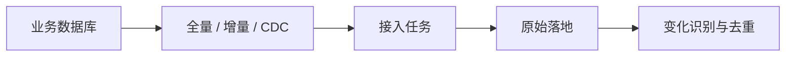
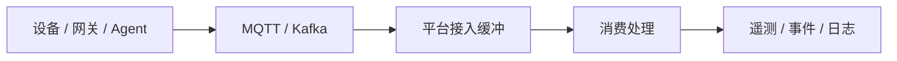
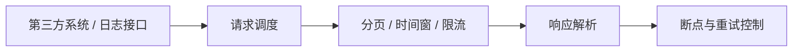
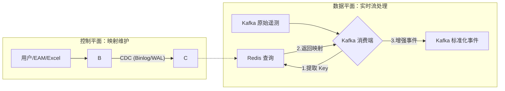
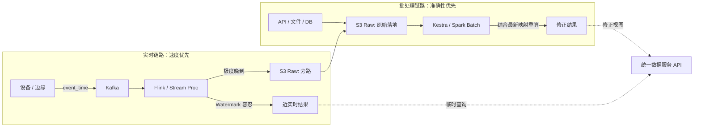

# 三、构建统一数据入口：多源数据摄取与 Asset/Tag 统一映射

## 1. 引言：从“数据接入”走向“数据对齐”

在工业数据平台建设中，数据接入仅是起点，而非终点。虽然数据库、消息流、文件及 API 均可接入平台，但这并不等同于完成了真正的集成。核心挑战在于：**来自不同系统、不同节奏、不同格式的数据，能否围绕同一组业务对象实现稳定对齐。**

在 EAM SaaS 场景中，这一问题尤为突出：

- **编码异构**：同一台设备在 EAM、MES、SCADA、Historian 中可能拥有完全不同的编码；
- **定义歧义**：同一测点在不同系统中可能存在名称、单位及定义的差异；
- **来源混杂**：主数据源于数据库，实时遥测源于消息流，历史补录源于文件，日志行为源于 API。

若平台仅止步于“接入”而缺乏“对齐”，后续的建模、分析、报表及 AI 应用将深受其害。因此，本章聚焦于三个关键命题：

1. 为何不同来源的数据无法采用单一处理模式；
2. 为何 Asset/Tag 的统一映射是工业数据集成的必经之路；
3. 在批处理与实时流并存的架构下，如何维持链路的可维护性与可演进性。

工业数据集成的终极目标，不是确认“数据是否进入平台”，而是确保“数据进入后能围绕统一业务对象被理解与复用”。

------

## 2. 多源数据摄取：差异化集成策略

试图用单一模式处理所有数据源是早期数据平台的常见误区。数据库、消息流、文件和 API 的本质差异决定了其集成策略必须分化：

- **数据库**：关注增量边界与删除感知；
- **消息流**：关注顺序一致性、幂等性与回放能力；
- **文件**：关注审计追踪、版本控制与补录机制；
- **API**：关注分页逻辑、限流策略与历史窗口覆盖。

忽视这些差异将导致平台前期看似统一，后期陷入混乱。

### 2.1 不同来源的数据集成重点概览

| 数据来源   | 常见场景                       | 主要挑战                           | 集成重点                     |
| ---------- | ------------------------------ | ---------------------------------- | ---------------------------- |
| **数据库** | 主数据、工单、业务状态         | 增量识别、删除感知、重复写入       | 增量边界、CDC、重跑控制      |
| **消息流** | 遥测、状态、告警、日志         | 乱序、重复、延迟、回放             | 缓冲解耦、事件时间处理       |
| **文件**   | 历史导入、客户补录、报表       | 重复上传、版本混乱、字段漂移       | 审计追踪、去重、补录管理     |
| **API**    | 第三方接口、日志、Agent traces | 分页复杂、限流、字段变更、历史缺失 | 断点续传、兼容适配、重试机制 |

### 2.2 数据库类数据摄取

数据库承载设备主数据、工单及业务状态。其难点不在于同步技术，而在于**变化识别的准确性**。

理想情况下应利用 CDC（Change Data Capture）直接消费增删改事件，但现实中常需依赖全量抽取或基于时间字段的增量同步。核心关注点包括：

- **增量依据**：选择可靠的时间戳或自增 ID；
- **字段可信度**：`updated_at` 是否真实反映业务变更；
- **删除感知**：如何识别物理删除或逻辑删除；
- **幂等控制**：失败重跑时如何避免数据重复。

数据库接入的本质是**精准识别变化边界**，而非简单复制。



### 2.3 消息流与工业时序数据摄取

此类数据承载设备遥测、状态事件及运行日志，具有“持续到达”而非“按批变化”的特征。

在架构上，MQTT 常用于设备侧或边缘上报，Kafka 则作为平台内部的统一缓冲层，提供解耦、回放与恢复能力。集成核心在于：

- **乱序与重复处理**：保障数据最终一致性；
- **Message Key 设计**：确保同设备数据有序；
- **重放机制**：支持故障后的数据回溯；
- **时间语义**：严格区分 Event Time（事件发生时间）与 Ingest Time（摄入时间）。

流式接入的关键指标不是“速度”，而是**稳定性与可回放性**。



### 2.4 文件类数据摄取

文件数据（Excel/CSV）常用于历史导入、补录及第三方报表。其治理难度常被低估，解析并非难点，**数据治理**才是核心：

- **重复识别**：防止同一文件多次上传导致数据膨胀；
- **版本追踪**：区分同名文件的不同内容版本；
- **补录隔离**：明确区分原始数据与补录数据；
- **Schema 漂移**：应对列名、顺序及类型的动态变化。

文件类数据往往是后期维护成本最高的来源，必须建立完善的**审计、去重与版本管理机制**。

### 2.5 API 类数据摄取

API 接入灵活但脆弱，长期稳定性易受挑战。常见风险包括分页逻辑复杂、时间窗口重叠或遗漏、限流阻断同步、字段静默变更及历史数据不可回溯。

API 集成的关键在于构建**长效维护机制**：

- **断点管理**：精确记录同步游标；
- **重试策略**：智能处理网络波动与限流；
- **历史回采**：具备弥补数据缺失的能力；
- **兼容适配**：应对接口字段变更的缓冲策略。




## 3. Asset / Tag 统一映射：工业数据集成的核心语义

多源数据摄取解决了“数据如何进入平台”的通道问题，而 Asset / Tag 统一映射则解决了“数据进入后归属于谁”的语义问题。在工业场景中，这一步的复杂度往往远超接入本身。EAM 中的资产编码、SCADA 中的设备名称、Historian 中的 Tag 以及传感器侧的 Sensor Code，虽然指向同一物理实体，却缺乏天然的一致性。若无法在 ingestion 阶段完成对象对齐，后续的查询聚合、告警归因及分析建模将失去稳定的根基。

Asset / Tag 映射并非临时的配置项，而是平台的核心业务数据。它既支持用户在 EAM 界面手工维护，也支持通过 Excel 批量导入，最终形成一套可追溯、可演进的动态关系网络。

### 3.1 映射难点：从字符串转换到对象对齐

Asset / Tag 映射的挑战不在于命名规范的不统一，而在于对象关系的内在复杂性：

1. **多码同源**：同一设备在不同系统中拥有多套标识（别名、采集点、Topic 路径等），平台需识别这些独立字符串背后的同一实体。
2. **一对多归属**：一个 Asset 通常对应多个 Tag（温度、压力、振动等）。平台不仅要解析 Tag 名称，更要明确其归属的 Asset 上下文。
3. **语义歧义**：同名 Tag 可能代表不同含义（如入口温度 vs 出口温度，或原始值 vs 计算平均值）。简单的字符串重命名会导致严重的语义混淆。
4. **动态演化**：设备变更、补录注册、编码重构使得映射关系处于持续变化中。平台面对的是一张“永远在更新”的动态网，而非静态对照表。

因此，映射的本质是**跨系统的对象对齐**，而非单纯的字段转换。

### 3.2 核心原则：保留原始，绑定标准

统一映射不应被理解为“覆盖原始数据”，而应建立“原始标识（Source Identity）”与“标准标识（Canonical Identity）”的双层架构。

- **原始层**：完整保留 `source_asset_id`、`source_tag_code` 及来源系统信息，确保审计与故障排查时可回溯至源头。
- **标准层**：生成全局唯一的 `asset_id` 和 `tag_id`，作为下游分析、告警和 AI 模型的统一输入。
- **关系层**：维护两者之间的映射规则，包含生效时间、租户上下文及版本信息。

这种设计实现了“先保留来源，再完成绑定”，既满足了下游统一分析的需求，又保留了面向运维的来源追溯能力。

### 3.3 映射模型的关键要素

一套可用的映射模型不能仅是简单的键值对，必须包含完整的上下文约束。核心字段设计如下：

| 对象类别       | 关键字段示例                                               | 作用说明                               |
| -------------- | ---------------------------------------------------------- | -------------------------------------- |
| **身份映射**   | `source_asset_id`, `asset_id`, `source_tag_code`, `tag_id` | 建立原始标识与标准标识的双向关联       |
| **归属关系**   | `asset_id`, `tag_id`                                       | 明确测点与设备的从属关系（一对多）     |
| **上下文约束** | `tenant_id`, `source_system`, `namespace`                  | 确保多租户及多源场景下的隔离性与唯一性 |
| **时效控制**   | `valid_from`, `valid_to`, `mapping_status`                 | 支持历史回溯、未来生效及临时禁用       |
| **版本审计**   | `mapping_version`, `updated_at`, `operator_id`             | 记录变更轨迹，支撑一致性校验           |

**实践思考**：在多租户 SaaS 环境中，必须将 `tenant_id` 作为映射主键的一部分。即使不同租户使用了相同的 `source_tag_code`（如 "Temp_01"），它们在逻辑上也必须指向完全不同的标准对象，严禁跨租户污染。

### 3.4 架构实现：分层解耦与实时绑定

本方案采用 **PostgreSQL 持久化 + CDC 同步 + Redis 缓存 + Kafka 轻量绑定** 的分层架构，将对象对齐前置到数据摄入的早期阶段。



#### 3.4.1 PostgreSQL：全量关系与审计中心

PostgreSQL 作为映射关系的“单一事实来源（Source of Truth）”，存储完整的映射生命周期数据。

- **完整性**：不仅存储当前有效映射，还保留历史版本（通过 `valid_from/to` 或版本号区分），以支持历史数据的重放与修正。
- **约束性**：建立复合唯一索引（如 `UNIQUE(tenant_id, source_system, source_tag_code, valid_from)`），防止同一时空下的规则冲突。
- **批量操作**：支持事务性的 Excel 批量导入，确保成百上千条映射规则的原子性更新。

#### 3.4.2 CDC 同步：低延迟的一致性传递

利用 CDC（Change Data Capture）技术监听 PostgreSQL 的变更日志，将映射变动实时推送至 Redis，替代传统的定时轮询。

- **优势**：映射变更后秒级生效，无需等待调度周期；仅传输增量变更，降低数据库负载。
- **缓存策略**：Redis Key 设计为组合键 `map:{tenant_id}:{source_system}:{source_tag_code}`。Value 存储精简后的绑定对象（`asset_id`, `tag_id`, `version`），避免消费端进行二次组装。
- **失效处理**：当映射被删除或过期时，CDC 事件应触发 Redis 键的删除或标记为“无效”，确保消费端能感知状态变化。

#### 3.4.3 Kafka 消费端：无状态轻量绑定

Kafka 消费端（如 Flink/Spark Streaming 或自定义 Consumer）仅负责执行高效的查找与增强操作，不承载复杂业务逻辑。

- 处理流程：
  1. 解析原始消息，提取 `tenant_id`, `source_system`, `source_tag_code`。
  2. 访问 Redis 获取最新映射（本地可辅以 LRU 缓存进一步降低网络 IO）。
  3. **命中**：注入 `asset_id`, `tag_id`，输出标准化事件至下游 Topic。
  4. **未命中**：执行兜底策略（见下文）。
- **性能考量**：由于映射数据量相对遥测数据极小，Redis 查询耗时通常在亚毫秒级，不会成为流处理的瓶颈。

#### 3.4.4 兜底策略：应对映射缺失的常态

工业现场“数据先行，注册滞后”是常态。对于未命中映射的消息，严禁直接丢弃：

- **旁路隔离**：将未映射消息写入独立的 `dead_letter_queue` 或 `unresolved_topic`，避免污染主链路数据质量。
- **状态标记**：在消息头或体中标记 `mapping_status: unresolved`，便于后续监控与统计。
- **自动重放**：当用户补录映射关系后，触发重放机制，将旁路队列中的历史数据重新拉取并完成绑定，确保数据完整性。

#### 3.4.5 版本一致性与最终一致性窗口

在 CDC 同步存在微小延迟的场景下，可能出现“新数据命中旧规则”的短暂不一致。

- **接受窗口**：承认并容忍秒级的最终一致性窗口，这是分布式系统的固有特征。
- **版本溯源**：在输出事件中携带 `mapping_version`。若后续发现映射错误，可通过版本号快速定位受影响的数据范围，并进行针对性修正。
- **幂等设计**：下游处理逻辑需基于 `event_id` 或 `timestamp+tag` 具备幂等性，以应对因映射修正导致的数据重放。

## 4. 批流协同：时间语义、幂等控制与对象对齐的深度实践

在工业数据平台架构中，批处理（Batch）与实时流（Stream）并非互斥的技术选型，而是必须长期共存的互补形态。实时链路（Kafka + Flink/Spark Streaming）承载设备遥测、即时告警与状态监控，追求毫秒级延迟与高吞吐；批处理链路（S3 + Airflow/Kestra + Snowflake/Spark）则负责主数据同步、API 历史回拉、文件补录与大规模重算，强调数据的最终一致性、边界可控性与修正能力。

真正的工程挑战不在于“同时运行两条链路”，而在于**如何确保同一业务对象的数据，在不同时间窗口、经由不同路径、携带不同版本上下文进入系统后，仍能收敛于统一的事实**。若缺乏精细的协同机制，平台将迅速陷入数据分裂的泥潭：实时大屏显示的设备状态与 T+1 报表不一致、补录的历史数据覆盖了错误的实时值、主数据变更后流式计算仍沿用旧映射。

因此，批流协同的核心命题是：**构建一套能够容忍乱序、支持重放、且基于统一对象语义收敛的数据治理体系。**

### 4.1 时间语义：构建多层级时间轴与晚到数据处理

工业现场的网络抖动、边缘网关缓存、协议轮询机制以及人工补录操作，导致数据“晚到（Late Data）”和“乱序（Out-of-Order）”是常态而非异常。若平台混淆“数据到达时间”与“事件发生时间”，所有基于时间窗口的聚合分析（如小时级能耗、OEE 计算、故障归因）都将失真。

#### 4.1.1 三层时间字段的严格定义与用途

平台必须在数据模型的最顶层（Ingestion Layer）显式区分并保留三类时间戳，严禁混用：

1. **`event_time` (业务时间)**：
   - **定义**：事件在物理世界发生或源系统记录的真实时刻（如传感器采样时间、PLC 寄存器写入时间）。
   - **用途**：这是**分析与业务逻辑的唯一真理时间轴**。所有窗口聚合、趋势分析、状态机跳转必须基于此字段。
   - **实践**：即使数据在 3 天后才到达，其 `event_time` 仍应标记为 3 天前，并允许写入历史时间窗口。
2. **`ingest_time` (接入时间)**：
   - **定义**：平台网关、Loader 或 Kafka Producer 接收到数据的系统时刻。
   - **用途**：用于计算**端到端延迟**（Latency = Process Time - Event Time），评估网络质量、边缘缓存积压情况，以及排查“数据为何晚到”。
3. **`process_time` (处理时间)**：
   - **定义**：计算引擎（Flink/Spark）实际处理该记录并写入下游存储的时刻。
   - **用途**：用于监控计算集群负载、背压（Backpressure）情况及 SLA 达成率。

#### 4.1.2 组件层面的时间策略与实践细节

#### （1）Kafka：分区键设计与局部有序性

Kafka 无法保证全局有序，但可以通过合理的 Key 设计保证**业务对象的局部有序性**，这是处理乱序的第一道防线。

- Key 设计原则：严禁使用随机 UUID 或纯时间戳作为 Partition Key。

  - **遥测数据**：推荐使用 `tenant_id + asset_id` 或 `tenant_id + tag_id`。这确保了同一设备的所有测点数据落入同一分区，在该分区内保持 FIFO 顺序。
  - **日志/Traces**：使用 `tenant_id + session_id` 或 `trace_id`。

- Watermark 机制：在流计算引擎（如 Flink）中，必须基于 

  ```
  event_time
  ```

   提取 Watermark。

  - **允许迟到（Allowed Lateness）**：配置合理的容忍窗口（如 5 分钟）。在此窗口内到达的晚到数据可触发窗口重新计算。
  - **侧输出（Side Output）**：对于超过容忍窗口的“极度晚到”数据，不应直接丢弃，而应路由到侧输出流（Side Stream），写入 S3 或特定 Topic，供批处理链路后续修正。

#### （2）InfluxDB / TSDB：原生支持无序写入

时序数据库是 `event_time` 语义的最终承载者，必须具备处理乱序写入的能力。

- **写入策略**：写入时显式指定 `timestamp` 参数为 `event_time`。现代 TSDB（如 InfluxDB 3, TimescaleDB）内部采用 LSM-Tree 或类似结构，支持将新到达的旧数据插入到时间序列的中间位置，而非仅追加到末尾。
- **覆盖策略**：对于同一 `timestamp` + `tag` 的重复写入，通常采用“最后写入胜利（Last Write Wins）”或基于 `ingest_time` 的版本控制。
- **降采样与修正**：预计算的降采样数据（Downsampling）必须具备**重算机制**。当历史窗口收到补录数据时，需触发该窗口的降采样任务重新执行，否则长期趋势图将出现断点或突变。

#### （3）S3 + Snowflake：批处理链路的“最终修正权”

实时链路追求“快”，批处理链路追求“准”。两者通过分层存储协同工作。

- Lambda 架构变体：
  - **Speed Layer (实时)**：Kafka -> Flink -> InfluxDB。提供最近 1-2 小时的近实时视图，允许少量误差。
  - **Batch Layer (离线)**：Kafka/S3 Raw -> Spark/Kestra -> Snowflake。每日定时（T+1）或每小时（H+1）从 S3 原始数据湖读取全量/增量数据，结合最新的映射关系，对过去 24 小时甚至 7 天的数据进行**覆盖式重算（Overwrite）**。
- **合并策略**：Snowflake 中的最终表应采用 `MERGE INTO` 语句，基于 `event_time` + `asset_id` + `tag_id` 作为唯一键，用批处理计算出的“准确值”覆盖实时链路写入的“近似值”。



### 4.2 一致性与幂等：构建“可重放”的零副作用链路

在批流并存架构中，重复数据是必然产物：网络抖动导致的生产者重试、Kafka Consumer Rebalance 导致的重复消费、API 分页重叠、文件重复上传、以及人为触发的历史重放。**系统的稳定性不取决于“是否收到重复消息”，而取决于“重复消息是否产生重复副作用”。**

#### 4.2.1 统一的事件唯一标识（Event ID）生成策略

平台必须在数据进入标准化层之前，生成或提取全局唯一的 `event_id`。这是幂等控制的基石。

- **源端自带 ID**：若源系统（如 MES 工单、ERP 事务）提供全局唯一 ID，优先直接使用。
- 复合键哈希：若源端无唯一 ID（如 MQTT 遥测），必须基于业务语义构造复合键并哈希：
  - 公式：`SHA256(tenant_id + source_system + source_asset_id + source_tag_code + event_time_ms)`
  - **关键点**：`event_time` 必须精确到毫秒，且来源必须可靠。若源端时间不可信，需结合 `ingest_time` 和序列号（Sequence Number，若设备支持）。
- **贯穿全链路**：该 `event_id` 必须作为主键或唯一索引，贯穿 Kafka Message Header、S3 文件名/元数据、InfluxDB Tag、Snowflake 主键。

#### 4.2.2 存储层的幂等写入模式详解

- **流式写入（InfluxDB/HBase/DynamoDB）**：
  - 利用时序数据库特性：相同 `timestamp` + `tags` 的写入会自动覆盖旧值。
  - **风险点**：时钟漂移。若生产者重试时 `event_time` 发生微小变化（如毫秒级差异），可能导致重复点。
  - **对策**：在写入前，流计算引擎可维护一个短期的 Bloom Filter 或 LRU Cache（基于 `event_id`），过滤掉极短时间窗口内的完全重复消息。
- **批式写入（Snowflake/Postgres/BigQuery）**：
  - **严禁 `INSERT`**：所有入库操作必须使用 `MERGE INTO` (Upsert) 或 `INSERT ... ON CONFLICT DO UPDATE`。
  - **匹配键**：使用 `event_id` 或 `(asset_id, tag_id, event_time)` 作为匹配条件。
  - **更新策略**：通常采用“新数据覆盖旧数据”策略。若需保留变更历史，可引入 `ingest_time` 作为辅助判断，仅当新数据的 `ingest_time` 晚于旧数据时才更新（防止旧的重放数据覆盖新的修正数据，但这通常需要更复杂的版本控制）。

#### 4.2.3 跨链路的幂等协同与“去重主键规范”

最危险的场景是**规则不一致**：实时流按 `tag_id + timestamp` 去重，而 API 补录任务按外部 `record_id` 去重，导致同一事实在数仓中被存为两条记录。

- 解决方案：定义统一的**“去重主键规范（Deduplication Key Specification）”**。
  - 无论数据来源是 MQTT、REST API、JDBC 还是 Excel，在进入 Standardized Layer（标准化层）前，ETL 逻辑必须将其转换为包含统一 `event_id` 的标准 Schema。
  - 所有下游消费者（无论是实时 Dashboard 还是离线报表）都基于这个统一的 `event_id` 进行去重和关联。

### 4.3 Schema 演化：建立“变化隔离层”与契约管理

工业现场的 Schema 极不稳定：设备固件升级改变 Payload 结构、客户手工修改 Excel 列顺序、第三方 API 字段静默更名。Ingestion 层必须充当**“变化隔离层（Change Isolation Layer）”**，防止上游波动扩散至核心数仓。

#### 4.3.1 原始层（Raw Layer）的不可变性原则

- **S3 Raw Zone**：所有原始数据（JSON, CSV, Binlog, XML）必须以“原样”落地 S3，**禁止**在接入阶段进行任何清洗、裁剪、类型转换或字段重命名。
  - **目录结构建议**：`s3://bucket/raw/tenant_id/source_type/source_id/event_date/hour/partition_id.jsonl`
  - **价值**：当上游 Schema 变更导致解析失败，或发现历史逻辑错误时，可立即暂停消费，修复解析器后，从 S3 重新回放原始数据，无需依赖源系统重发（源系统往往已无法提供历史数据）。
- **Kafka Raw Topic**：保留完整的 Envelope 结构，包括原始 Header、Metadata 和 Payload。建议使用 Schema Registry（如 Confluent Schema Registry）进行版本管理，但配置为 `BACKWARD_COMPATIBLE` 或 `NONE`，允许演进。

#### 4.3.2 兼容策略与降级处理机制

- **宽容解析（Lenient Parsing）**：
  - **未知字段忽略**：解析器遇到未定义的新增字段时，应忽略而非报错。
  - **缺失字段默认值**：对于可选字段缺失，填充预设默认值（如 `null`, `0`, `UNKNOWN`）。
  - **类型安全转换**：尝试将字符串转为数字失败时，记录错误并置空，而非抛出异常中断任务。
- **版本化解析器（Versioned Parsers）**：
  - 为关键数据源维护多版本解析逻辑（如 `parser_v1`, `parser_v2`）。
  - 在消息 Header 或元数据中携带 `schema_version`。流处理作业根据版本号动态路由到对应的解析逻辑。
- **死信队列（DLQ）与人工干预**：
  - 对于无法解析、关键字段缺失或校验失败的“脏数据”，自动路由至 DLQ Topic（包含原始 Payload 和错误原因）。
  - 配套开发“重放工具”，允许运维人员在修复问题后，手动触发 DLQ 消息的重放。

#### 4.3.3 Schema 管理的契约化

Schema 管理不仅是技术字段的管理，更是业务契约的管理。

- **元数据注册**：建立中央元数据仓库，记录每个数据源的预期 Schema、版本历史、负责人及变更日志。
- **自动化测试**：在 CI/CD 流水线中集成 Schema 兼容性测试。当发布新的解析器版本时，自动使用历史样本数据进行回归测试，确保不会破坏现有链路。
- **变更通知机制**：对于高风险来源（如核心 API），建立变更通知流程。一旦检测到 Schema 漂移（如字段类型改变、枚举值增加），立即触发告警。

### 4.4 对象对齐：批流协同的“单一事实来源”

批流协同中最隐蔽且致命的陷阱是**对象语义分裂**：实时流使用 Redis 缓存中的旧映射（因为缓存未刷新），而批处理任务读取了 PostgreSQL 中的新映射，导致同一设备在实时大屏和 T+1 报表中“身份不一”，数据无法关联。

#### 4.4.1 映射规则的集中化管理（SSOT）

- **单一事实来源（Single Source of Truth）**：所有链路（Kafka Consumer, API Loader, File Importer, Batch Job）必须从**同一个中心**获取映射关系。
  - **架构模式**：PostgreSQL（持久化存储 + 版本审计） -> CDC (Debezium) -> Kafka/RocketMQ -> 实时订阅服务 -> Redis（高速缓存）。
  - **禁止行为**：严禁在采集脚本、ETL 代码、SQL 存储过程或 Excel 宏中硬编码映射逻辑（如 `if topic == 'Line1_Temp' then asset_id = 'A001'`）。
- **推送式更新**：利用 CDC 技术，当 PostgreSQL 中的映射关系发生变更（Insert/Update/Delete）时，立即捕获变更事件并发布到消息队列。所有在线的流处理任务和批处理调度器订阅该队列，实时更新本地缓存或触发重算。

#### 4.4.2 映射版本的上下文传递与追溯

为了追溯数据归属的历史准确性，标准化后的事件中**必须**携带映射元数据，而不仅仅是 `asset_id`。

- **关键字段**：
  - `mapping_version`：记录该条数据绑定时所使用的映射规则版本号（如 `v1.2`）。
  - `mapping_status`：明确标识是 `RESOLVED`（已对齐）、`UNRESOLVED`（未命中）还是 `DEPRECATED`（映射已废弃）。
  - `source_identity_snapshot`：必要时快照原始的 `source_asset_id` 和 `source_tag_code`，以防映射关系被误删后无法回溯。
- **场景价值**：
  - **精准定位**：当发现某批次数据归属错误时，可通过 `mapping_version` 快速定位是哪一次映射变更（谁、在什么时间、改了什么）导致了问题。
  - **版本重放**：当需要修正历史数据时，可指定“使用 `v1.5` 版本的映射规则重放 2023-10-01 的数据”，确保重算结果的可复现性。

#### 4.4.3 未命中数据的隔离与自动重放机制

- **零容忍默认值**：严禁将未匹配到 Asset 的数据强行归类到“默认设备”、“未知设备”或生成临时伪 ID。这会严重污染统计结果，导致“未知设备”的能耗或产量虚高。
- 旁路隔离（Side Channel）：
  - 所有未命中映射的数据必须进入独立的 `unresolved_topic` 或 S3 隔离区。
  - 消息体中保留完整的原始上下文，并标记 `error_code: MAPPING_MISSING`。
- 触发式重放（Triggered Replay）：
  - **监听映射事件**：当用户在 EAM 界面补录了新的映射关系（PostgreSQL 发生 Insert/Update），CDC 捕获该事件。
  - **自动重放服务**：一个独立的后台服务监听映射变更事件。一旦检测到新的映射规则生效（例如 `tag_X` 现在映射到了 `asset_Y`），该服务自动从 `unresolved_topic` 或 S3 隔离区中拉取过去 N 小时（可配置）内涉及 `tag_X` 的所有消息。
  - **重新注入**：应用新的映射规则处理这些消息，生成标准化的事件，重新注入主链路（Main Topic）。
  - **幂等保障**：由于主链路具备幂等性，这种重放不会产生重复数据，只会修正之前的“缺失”状态。

## 5. 避坑指南：工业数据集成的五大深层误区

在工业数据平台建设初期，团队常因追求“快速上线（Time-to-Market）”或过度简化架构，而做出短期看似合理、长期代价高昂（Technical Debt）的技术决策。以下是五个高频误区及其深度解析与修正建议。

### 5.1 误区一：将“接入成功”等同于“集成完成”

- **现象描述**：
  项目验收时，演示屏幕上显示数据库连接成功、MQTT 消息在 Kafka 中流动、Excel 文件解析无误。团队认为“数据已进平台”，项目即告完成。

- 深层后果：

  - **数据孤岛内部化**：数据虽然进了同一个平台，但仍然是“(raw) 数据沼泽”。没有统一的时间语义，没有对象归属，没有质量监控。
  - **下游瘫痪**：AI 团队发现数据无法训练（时间错乱、标签缺失）；业务团队发现报表数据对不上（实时与离线不一致）。
  - **信任崩塌**：用户不再信任平台数据，转而依赖手工 Excel 台账。

- 修正策略：

  - 重新定义“完成”

    ：接入只是 Plumbing（管道铺设），集成才是 Semantics（语义赋予）。真正的完成标准必须包含：

    1. **对象对齐**：所有数据已绑定到统一的 `asset_id` 和 `tag_id`。
    2. **时间校准**：`event_time` 已提取并校正，乱序数据已妥善处理。
    3. **质量闭环**：具备完整性、一致性、及时性监控，且有明确的 DLQ 处理流程。
    4. **可复用性**：下游应用可直接使用标准化数据，无需二次清洗。

### 5.2 误区二：试图在第一天实现“全量统一”

- **现象描述**：
  在项目启动期（Phase 1），就要求梳理工厂内所有历史设备、所有测点、所有系统的编码，试图一次性建立完美的全局映射表，否则不许上线。
- 深层后果：
  - **项目停滞**：由于现场资料缺失、人员变动、系统老旧，全量梳理耗时数月甚至数年，导致平台迟迟无法交付价值。
  - **业务抵触**：一线人员因配合成本过高而产生抵触情绪，提供虚假信息或拖延配合。
  - **僵化架构**：为了迁就“一次性完美”，设计了过于复杂的前置校验流程，导致系统缺乏灵活性。
- 修正策略：
  - 渐进式对齐（Progressive Alignment）：
    1. **核心优先**：优先统一核心产线、高价值设备、关键 KPI 相关测点的映射。确保 MVP（最小可行性产品）尽快上线产生价值。
    2. **容忍未决**：允许长尾设备、非关键测点处于 `UNRESOLVED` 状态，进入旁路队列，不影响主链路运行。
    3. **运营驱动**：将映射补录作为日常运营工作，通过可视化看板展示“未映射数据量”，驱动业务方逐步完善。
  - **活的数据**：将映射系统设计为持续演进的“活数据”，支持增量维护、版本回溯和自动化重放，而非一次性静态工程。

### 5.3 误区三：将映射逻辑硬编码在采集脚本中

- 现象描述：

  为了省事，开发人员在 Python 采集器、Java Consumer 或 SQL 脚本中直接写死映射逻辑：

  ```python
  if topic == "FactoryA/Line1/Temp":
      asset_id = "ASSET_001"
  elif topic.startswith("Old_PLC"):
      asset_id = "ASSET_002" # 硬编码
  ```

- 深层后果：

  - **维护噩梦**：每次现场设备变更、产线调整，都需要开发人员修改代码、测试、重新打包、部署。响应周期从“分钟级”退化为“天级”。
  - **逻辑分裂**：同样的映射规则在 Flink 作业、Spark 任务、API 脚本中重复实现，极易出现不一致（Bug）。
  - **黑盒化**：业务人员无法查看或修改映射规则，必须依赖开发人员“翻译”，沟通成本极高且容易出错。
  - **审计缺失**：无法追溯“谁在什么时候改了哪条规则”，出问题后无法定责。

- 修正策略：

  - **代码与数据分离**：映射规则必须外置为配置数据，存储在 PostgreSQL 等关系型数据库中。
  - **动态加载**：通过 CDC 或配置中心（如 Nacos/Apollo），将映射变更实时推送到计算引擎的内存缓存（Redis/Local Cache）。
  - **自助服务**：提供 EAM 界面，允许授权的业务人员自助维护映射关系，系统自动记录操作日志并触发同步。

### 5.4 误区四：用同一种模式处理所有数据源

- **现象描述**：
  为了追求架构的“整洁”和“统一”，试图用一套通用的 ETL 框架或 Connector 处理数据库 CDC、MQTT 流、Excel 文件和 REST API。
- 深层后果：
  - 水土不服：
    - **文件**：缺乏版本控制、指纹去重，导致重复上传数据膨胀。
    - **API**：忽视限流、分页、断点续传，导致数据丢失或被封禁。
    - **流**：缺乏乱序处理和 Watermark 机制，导致分析失真。
  - **脆弱性**：一旦某个特殊来源（如某特定厂商的 API）出现异常，可能拖垮整个通用框架。
- 修正策略：
  - 承认异构，统一出口：
    - 接入层（Adapter Layer）：针对不同源采用专用适配器（Specialized Adapters）。
      - DB Adapter：专注 CDC、Binlog 解析、增量边界。
      - File Adapter：专注指纹校验、版本管理、Schema 推断。
      - API Adapter：专注限流重试、游标管理、分页组装。
      - Stream Adapter：专注反压、乱序缓冲、序列化。
    - **标准化层（Standard Layer）**：所有适配器输出统一格式的 Envelope（包含 `event_time`, `asset_id`, `payload` 等），进入 Kafka 或 S3。
  - **核心原则**：来源接入方式可以异构，错误恢复方式可以异构，但**进入平台后的语义模型必须收敛**。

### 5.5 误区五：低估文件与 API 接入的长期维护成本

- **现象描述**：
  在 PoC 阶段，团队认为数据库和 MQTT 最难搞（需要搭集群、配网络），而 Excel 导入和 API 对接只是“写个脚本”的小事，投入资源最少。
- 深层后果：
  - 文件黑洞：
    - 客户频繁修改模板（加列、改名、改顺序）且不通知。
    - 同名文件反复上传，内容却不同。
    - 补录数据与原始数据混杂，无法区分。
    - 最终导致文件接入成为“最难追责的数据黑洞”，消耗大量人力进行手工清洗。
  - API 陷阱：
    - 第三方接口静默变更（字段改名、类型变化）。
    - 限流策略在高峰期触发，导致数据大面积缺失。
    - 历史数据窗口限制，导致无法补拉。
    - 最终导致 API 链路频繁断裂，数据时断时续。
- 修正策略：
  - **重新评估优先级**：将文件和 API 视为**“高维护密度”**资产，预留充足的运维资源和预算。
  - 文件治理套件：
    - **指纹去重**：基于文件 Content Hash 而非文件名去重。
    - **版本留存**：所有上传文件原样归档 S3，建立版本索引。
    - **Schema 校验**：上传时自动探测 Schema，与基准比对，差异过大则拒绝或告警。
    - **审计追踪**：记录谁、何时、上传了什么文件、处理结果如何。
  - API 健壮性设计：
    - **断点持久化**：将 Cursor/Offset 持久化到 DB，确保故障恢复后精确续传。
    - **指数退避重试**：智能处理限流和网络波动。
    - **契约监控**：定期巡检 API 响应 Schema，发现漂移立即告警。
    - **Mock 与仿真**：在开发测试环境模拟 API 异常，验证系统的容错能力。

**总结**：工业数据集成是一场持久战。真正的成功不在于接入了多少 TB 的数据，而在于构建了一套**能够适应变化、自我修正、且语义统一**的数据生态系统。避免上述误区，坚持“语义优先、渐进演进、异构适配、治理先行”的原则，是平台从 PoC 走向规模化生产的关键。
